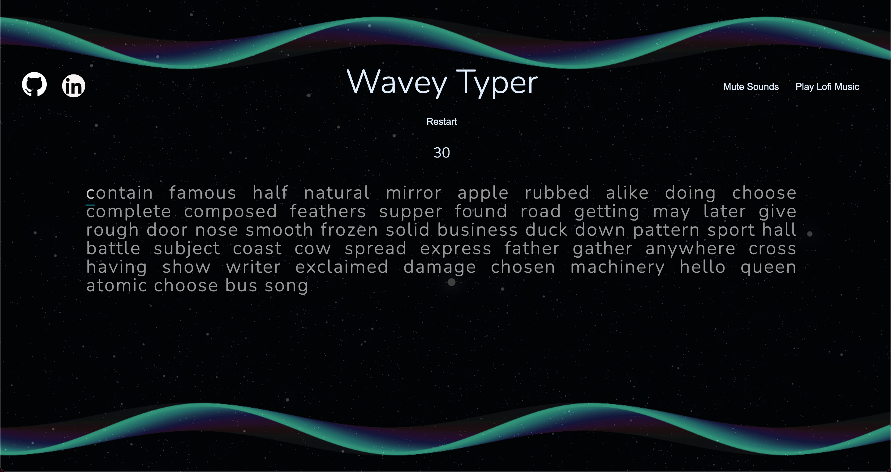
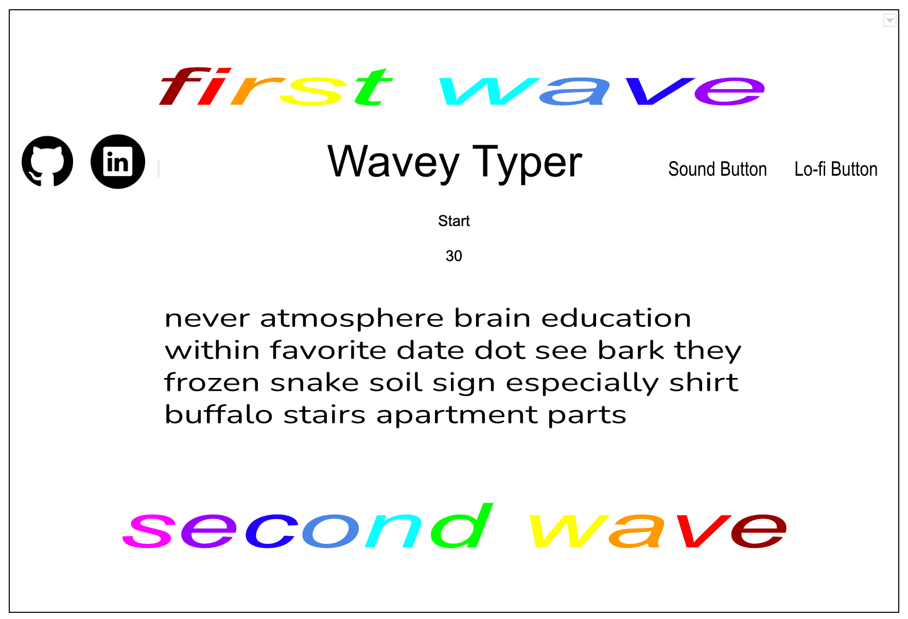

Live: https://victorhoang07.github.io/Wavey-Typer/

#  Background

Wavey Typer is a typing-based game. With the help of visual and audio cues, the player will be able to quickly recognize mistakes they make or every completed word

The goal of Wavey Typer is aimed towards improving the player's typing speed and accuracy. Through aesthetic visuals and calming music, the player can practice their typing skills in an enjoyable manner. Towards the end of each round, their words per minute (WPM) and other stats will be shown to display their performance.

# Functionality & MVPS

In Wavey Typer, players will be able to:
 - Start a new round and mute any sounds from the game
 - Type up randomly generated words
 - Visually see when they are typing the correct letters and when they make a mistake
 - Hear when they correctly type a word or incorrectly type a character
 - See their performance
 - Practice towards improved typing proficiency

 In addition, this project includes:
 - Instructions on how to play
 - Option to play Lo-fi music
 

 # Wireframe

 This game will take place in the player's browser. There will be simple and intuitive buttons to navigate the through the webpage. There will be a button for the instructions and lo-fi music option. It will also feature links to my Github and Linkedin profile. 
 https://wireframe.cc/lwmihp
 

 # Technologies, Libraries, and API's

 - Javascript: Used for game logic and wave manipulation
 - Canvas: Render waves
 - NPM and Webpack: Used for JavaScript file bundling and project management

 # Implementation Timeline 

 - Friday: Set up project and start planning out game logic.
 - Weekend : Complete game logic functionality and render waves. 
 - Monday : Create interactive sounds and wave manipulation based on player input
 - Tuesday : Include music and HTML buttons for functionality.
 - Wednesday : Finish styling and make code neat.

 ## Music Credit

Morning Routine by Ghostrifter Official | https://soundcloud.com/ghostrifter-official
Music promoted by https://www.chosic.com/free-music/all/
Creative Commons CC BY-SA 3.0
https://creativecommons.org/licenses/by-sa/3.0/
